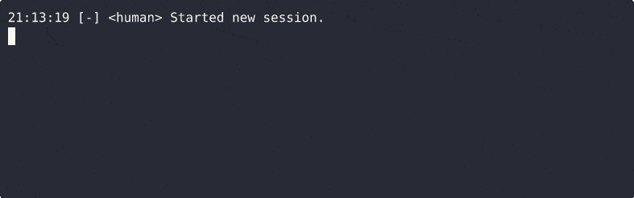

# FSM Driven Development

Your agent will generate [state machines](https://en.wikipedia.org/wiki/Finite-state_machine) while executing state machines that are generated by state machines.

Donna allows your agent to execute hundreds of consecutive steps without swaying away from the defined workflow. Branching, loops, nested calls, and recursion — all possible.



## What is Donna?

Donna is a CLI tool that helps coding agents like Codex focus on the task at hand by keeping high-level control flow in explicit Donna workflows. Donna dictates what should be done at each step of the work, so the agent can focus on the actual piece.

However, Donna is not an orchestrator; it is a tool for an agent — it can be used with any agent and does not require API keys or other credentials. You may look at Donna as the work diary or personal secretary for your agent.

The core idea:

- **Most high-level work is more algorithmic than it may seem at first glance.**
- **Most low-level work is less algorithmic than it may seem at first glance.**

For example, it may be non-trivial to fix a particular unit test, but the overall process of polishing the codebase is quite linear:

1. Ensure all tests pass.
2. Ensure the code is formatted correctly.
3. Ensure there are no linting errors.
4. Go to step 1 if you changed something in the process.
5. Finish.

Coding agents show great results at each step of the process; however, they often struggle to manage meta-loops — they forget steps, misinterpret results, use the wrong approaches to run tools, etc.

Donna executes such loops for the agents, thereby saving time, context, and tokens and simultaneously increasing the overall quality of work.

## Features

- **Deterministic workflows** — define fixed & validated control flow for agents to follow.
- **Saves context, tokens and time** — agents do not need to think when thinking is not required.
- **Readable artifacts** — all workflows and specifications are pure Markdown files with some [Jinja2](https://github.com/pallets/jinja) templating.
- **Artifact management** — non-fuzzy navigation and smart agent-focused rendering of artifacts.
- **Artifact distribution** — install your docs/workflows/skills as a Python lib.
- **Agent-centric behavior** — Donna guides agents through workflows, helps them be on the path, and fixes mistakes.
- **Extensible architecture** — implement your own operations, validators, renderers; add support for new artifact formats and storages (worlds).
- **Batteries included** — Donna goes with a set of pre-defined workflows, so you can start using it right away.

## Example

Donna is developed via Donna itself. You can find real-life examples of workflows and specifications in the [.donna/project](./.donna/project) folder of this repository.

The example below is a simplified version of the polishing workflow that formats code, runs linters, and fixes found problems until all checks pass. It uses the single operation type `donna.lib.request_action` to ask the agent to perform specific instructions.

```
                                no issues
[ run_black ] ──▶ [ run_mypy ] ───────────▶ [ finish ]
      ▲                │
      │  issues fixed  │
      └────────────────┘
```

<details>
<summary><strong>An example source and comments</strong></summary>

~~~
# Polishing Workflow

```toml donna
kind = "donna.lib.workflow"
start_operation_id = "run_black"
```

Polish and refine the codebase.

## Run Black

```toml donna
id = "run_black"
kind = "donna.lib.request_action"
```

1. Run `black .` to format the codebase.
2. `{{ goto("run_mypy") }}`

## Run Mypy

```toml donna
id = "run_mypy"
kind = "donna.lib.request_action"
```

1. Run `mypy .` to check the codebase for type annotation issues.
2. If there are issues found that you can fix, fix them.
3. Ask the developer to fix any remaining issues manually.
4. If you made changes `{{ goto("run_black") }}`.
5. If no issues are found `{{ goto("finish") }}`.

## Finish

```toml donna
id = "finish"
kind = "donna.lib.finish"
```

Polishing is complete.
~~~

What you may notice:

- The workflow is described in a readable Markdown file.
- The workflow has a loop.
- Each H1 and H2 section has a config block, which is a TOML in code fences with `donna` marker. Those configs are invisible to the agent, but Donna uses them to understand the artifact structure.
- H1 section describes the workflow as a whole.
- H2 sections describe workflow operations.
- The workflow has two `donna.lib.request_action` operations (`run_black`, `run_mypy`) and one `donna.lib.finish` (`finish`).
- Transitions between operations are defined via `{{ goto("operation_id") }}` Jinja2 calls in the body of operations.
- `donna.lib.request_action` is an operation that tells Donna to display instructions to the agent and wait for the agent to complete them. That allows the agent to focus on short, precise instructions, execute them, and advance the workflow.
- `kind` attributes of sections are valid Python import paths, so you can easily extend Donna with your own code.

Directives, like `{{ goto("operation_id") }}`, render itself depending on the context:

- For the agent, they render an exact CLI command to run, such as `donna -p llm sessions action-request-completed <action-request-id> 'artifact_id:operation_id'`.
- For Donna, they render a specific marker that can be extracted and used to analyze an artifact. For example, Donna uses `goto` directives to build an FSM of the workflow and validate it before running: does each operation exist, can the workflow be completed, are there unreachable operations, etc.

Generally speaking, **all you need is `donna.lib.request_action` operation** — it is enough to achieve a great deal of automation by delegating some decisions to the agent. However, there are some more specific operations that simplify things and make workflows more agile or performant.

</details>

You can find a more complex implementation of the same workflow in the [polish.md](./.donna/project/work/polish.md) file. It demonstrates other Donna operations, such as running scripts directly and branching.

## Installation

1. Install `donna` package.

```bash
uv tool install donna

# pipx install donna
```

2. Initialize Donna in your project.

```bash
cd <your-project-root>
donna workspaces init
```

Donna will:

- Create a `.donna/` folder in your project root with a default configuration in `.donna/config.toml`.
- Install skills into `.agents/skills/` folder.

3. Ask your agent to do something like `$donna-do Add a button that …`. The agent will discover the appropriate workflow and execute it.

## Skills

- `donna-do` — use Donna to perform a specific task in the current Donna session. Creates a new session if there is no one.
- `donna-start` — start a new Donna session and tell the agent to use Donna to perform all further work. Removes all content from the previous session.
- `donna-stop` — stop using Donna to perform work — the agent should switch to its own flow control.

## Usage

**Donna is a CLI tool for agents.** You rarely need to use it directly.

However, it is convenient to run `donna journal view --follow` in a separate terminal to see what is going on in the current session.

Commands you may need:

- `donna workspaces init` — Initialize Donna in your project.
- `donna sessions start` — start a new working session, remove everything from the previous session.
- `donna artifacts list <pattern>` — list artifacts with short descriptions.
- `donna journal view [--lines N] [--follow]` — view the log of work performed in the current session.

Here is an example of the real Donna session work log:


Use `donna --help` for a quick reference.

You find detailed documentation in the agent instructions — they are readable and always accurate:

- [CLI specification](./donna/artifacts/usage/cli.md) — full list of commands and how to use them.
- [Artifacts](./donna/artifacts/usage/artifacts.md) — what are Donna artifact and how to use them.
- [Worlds](./donna/artifacts/usage/worlds.md) — how Donna discovers and manages its artifacts.

The documentation below covers aspects important to humans and partially duplicates the agent's instructions.

## Batteries Included

Donna comes with built-in workflows and specifications that empower agents to work in a smart way.

However, **I encourage you to experiment and implement your own workflows**. Meta-programming is fun; specialized workflows are more efficient.

By default, Donna uses the next approach to introduce changes in your project:

1. Prepare a Request for Change (RFC) document that describes the required changes.
2. Create a workflow that implements the changes described in the RFC.
3. Execute new workflow.

Additionally, Donna will:

- choose fast or slow route depending on the complexity of the changes required;
- find and run (if any) polishing workflow to ensure the codebase is in a good state after the changes;
- find and run (if any) workflow to update your changelog.

Note that the default Donna workflows are designed to be reliable and useful for a wide range of projects. They may not be optimal in terms of token usage or speed for your particular project. The intended use of Donna is to implement your own workflows that account for your project's specifics.

Points of interest:

- [donna:rfc:specs:request_for_change](./donna/artifacts/rfc/specs/request_for_change.md) — specification of the RFC document.
- [donna:rfc:work:request](./donna/artifacts/rfc/work/request.md) — workflow to create a RFC document.
- [donna:rfc:work:plan](./donna/artifacts/rfc/work/plan.md) — workflow to plan work on an RFC — creates a new workflow.
- [donna:rfc:work:do](./donna/artifacts/rfc/work/do.md) — meta workflow to automate the whole work from a developer request to a changelog update.

## Artifacts and Worlds

- Artifacts are something that Donna owns. Currently, they are Markdown files with workflows and specifications.
- Worlds are storages for artifacts. Currently, Donna supports two types of worlds:
    - `donna.lib.worlds.filesystem` — a folder on the filesystem.
    - `donna.lib.worlds.python` — a Python package.

**Please, tell if you need other world types.** It looks interesting to have `http`, `s3`, `git`, `sql` worlds. How about an `email` world that allows you to send a workflow to someone agent and get the results back in your mailbox?

A world ID is the first part of an artifact ID. For example, `donna:usage:cli` artifact resides in the `donna` world.

By default, Donna uses the next worlds:

- `donna` — artifacts provided by Donna itself;
- `home` — user-level artifacts in `<HOME>/.donna/` folder;
- `project` — project-level artifacts in `<project-root>/.donna/project/` folder;
- `session` — session-level artifacts in `<project-root>/.donna/session/` folder.

Besides that, there is `<project-root>/.donna/tmp` folder used to store temporary files.

A world can be read-only. By default, writable worlds are `session` (current work scope) and `project` (project scope).

Agents are not allowed to edit artifacts directly because artifact consistency is important. Instead, they follow the next algorithm:

- Fetch an artifact into the temporary file with the command `donna -p llm artifacts fetch ...`.
- Edit the temporary file.
- Upload an artifact with the command `donna -p llm artifacts upload ...`.

On upload, Donna validates the artifact and accepts it only when there are no errors. For example, Donna will not accept a workflow that can not be finished.

### Rendering

Markdown artifacts are Jinja2 templates. Donna uses multiple rendering modes for different purposes.

More about Jinja2 rendering is described a bit further.

### Artifacts Discovery

Artifact is identified by its id: `<world>:<colon-separated-path>`, for example, `donna:usage:cli`.

You and agents can `list` artifacts and `view` them.

- `donna -p llm artifacts list <pattern>` — shows a short description from its h1 section.
- `donna -p llm artifacts view <pattern>` — shows the full content of the artifact with proper rendering.

Both commands accept both precise artifact ids and glob patterns. Patterns allow using:

- `*` to replace a single path segment;
- `**` to replace multiple path segments.

Examples:

- `*:artifact:name` — matches all artifacts named `artifact:name` in all worlds.
- `world:*:name` — matches all artifacts with id `something:name` in the `world` world.
- `**:name` — matches all artifacts with id ending with `:name` in all worlds.
- `world:**` — matches all artifacts in the `world` world.
- `world:**:name` — matches all artifacts with id ending with `:name` in the `world` world.

Both commands also accept `--tag <tag>` option to filter artifacts by their tags.

Currently, Donna supports two artifact tags:

- `workflow` — marks a workflow artifact — is set automatically by Donna.
- `specification` — marks a specification artifact — is set automatically by Donna.

You can find all workflows with the command `donna -p llm artifacts list '**' --tag workflow`.

## Sessions

`session` world contains the current state of work performed by Donna: all documents and workflows that are created during work and should not be stored permanently in the project.

The developer is responsible for starting/resetting sessions with commands from `donna -p human sessions` group.

- On session start, Donna removes everything from the previous session and creates a fresh `session` world.
- On session reset donna resets the state of the current session (tasks, action requests, etc.), but keeps artifacts.

The agent is encouraged not to manage sessions directly, because it doesn't have enough context to decide when session artifacts may be safely removed.

## Workflows

Workflows are [state machines](https://en.wikipedia.org/wiki/Finite-state_machine). They are defined in Markdown files with an h1 section of type `donna.lib.workflow` and multiple h2 sections that implement operations.

Donna tracks dependencies between operations and validates the workflow before running it. So, if you or your agent do something wrong, you'll get a clear error message from Donna.

You can run workflow as `donna -p llm sessions run <artifact-id>`.

To execute a workflow, Donna uses a simplified virtual machine (VM) that maintains the current state of all workflows executed in the current session.

<details>
<summary><strong>What you may want to know about workflows implementation</strong></summary>
- `.donna/session/state.json` file contains the current state of all running workflows in the current session.
- Each workflow executes in the context of its own task, which is a distant analog of a call stack frame. So, we may look at workflows as functions.
- Of course, workflows may call other workflows as subroutines. At any moment, only last executed workflow is active.
- Task has a context that is accessible by operations. There is an issue [command to read/write task context](https://github.com/Tiendil/donna/issues/47) to allow agents and humans to edit task context.
- The internal VM operates in terms of work units. An operation can produce multiple work units, so it should be possible to implement different interesting scenarios; however.
</details>

### Operations

You can find detailed docs on built-in operations in the [artifacts documentation](./donna/artifacts/usage/artifacts.md).

Here is a short list of them:

- `donna.lib.request_action` — request the agent to perform specific instructions.
- `donna.lib.run_script` — run a script from the environment Donna is running in. Choose the next operation based on the return code. Can store `stdout` and `stderr` in the task context.
- `donna.lib.output` — output a cell with specific content and immediately goes to the next operation.
- `donna.lib.finish` — finish the workflow. This operation MUST be present in the workflow and MUST end all possible execution paths.

### Error handling

Donna can detect errors (in artifacts, in execution, etc). If an error can be fixed by the agent or the developer, Donna will output a detailed error description with a list of ways to fix it.

<details>
<summary><strong>An example of error message from Donna</strong></summary>

```bash
$ donna -p llm sessions run project:work:polish

kind=artifact_validation_error
media_type=text/markdown
artifact_id=project:work:polish
error_code=donna.artifacts.section_not_found
section_id=run_autoflake_scriptx

Error in artifact 'project:work:polish', section 'run_autoflake_scriptx': Section `run_autoflake_scriptx` is not available in artifact `project:work:polish`.

Ways to fix:

- Check the section id for typos.
- Ensure the section exists in the artifact
```

</details>

### Generating workflows

The power of Donna comes from the ability to create workflows on the fly and execute them immediately. So, you can create a workflow that creates a workflow that creates a workflow that does something useful :)

You can even modify the workflow while it is executing; the only requirement is not to lose the ids of the operations referenced in action requests.

The simplest example of such generation is currently used as a primary way for Donna to work on the current project:

1. Create a document with a change description.
2. Generate a workflow that defines an order of applying changes.
3. Execute the generated workflow.

### Discovering workflows

If you want to run a child workflow from an operation, you can just instruct an agent like `Run the workflow project:work:my-cool-workflow` and the agent will find it and run.

However, it is not very agile. Instead, I suggest you describe the desired outcome and let the agent find the most suitable workflow. In that case, you'll be able to define customized workflows for specific types of changes and let the agent choose the best one for the current situation.

For example, you can have two workflows `project:work:write-backend-test` and `project:work:write-frontend-test`, and your operation can say `Run the workflow that will write a test for the current change`, and the agent will choose the most suitable workflow based on the context and the workflow descriptions.

## Jinja2 rendering

Markdown artifacts are Jinja2 templates that are rendered immediately upon loading, before parsing Markdown.

There are multiple rendering modes that Donna uses for different purposes:

1. `view` — artifact is rendered for displaying to the agent or the developer.
2. `execute` — artifact is rendered for execution. This mode has access to the current task context, so we can add a variable from it into the operation instructions.
3. `analyze` — artifact is rendered to be analyzed by Donna itself. For example, to extract `goto` directives from operation bodies and validate the workflow structure.

All Jinja2 rendering is supported, except inheritance-related features. So, an artifact is self contained template.

The rendering is performed before processing Markdown, so you can use Jinja2 features (like loops, conditionals, etc) to generate complex artifacts.

### Directives

Donna defines a set of built-in Jinja2 functions that provide artifacts with their special capabilities. Such functions are called directives.

Directives are used in the next way: `{{ python.import.path(<args>) }}`.

You can find a detailed documentation of all built-in directives in the [artifacts documentation](./donna/artifacts/usage/artifacts.md).

Here they are:

1. `donna.lib.view` — references another artifact. In `view`/`execute` modes, it renders an exact CLI command to view the artifact. In analysis mode, it will be used to validate the existence of the artifact and track dependencies between artifacts.
2. `donna.lib.list` — references artifact listing. In `view`/`execute` modes, it renders an exact CLI command to list artifacts. In analysis mode, it will be used to validate the existence of the artifacts and track dependencies between artifacts.
3. `donna.lib.goto` — references the next workflow operation to execute. In `view`/`execute` modes, it renders an exact CLI command to advance the workflow. In `analysis` mode, it is used to construct and validate an FSM for the workflow.
4. `donna.lib.task_variable` — in `view` mode renders a placeholder with a note about task-variable substitution, in `execute` mode renders the actual task-context value. In `analysis`, it will be used to control a set of variables used in the artifact.

## Specifications

Specifications can be perceived just as documentation. There is no special handling for them.

Later, they will be validated like workflows, but currently, it is just docs.

## Extending Donna

All Donna logic is referenced by Python import paths. That means:

- You can implement your own functionality and use it with Donna.
- You can enrich your Python packages with additional code to work with Donna.
- You can distribute your Donna artifacts as Python packages.

What you can implement:

- Custom sections (including operations) for Donna artifacts. Check [./donna/primitives/artifacts](./donna/primitives/artifacts) and [./donna/primitives/operations](./donna/primitives/operations) subpackages for examples.
- Custom rendering directives. Check [./donna/primitives/directives](./donna/primitives/directives) subpackage for examples.
- Custom worlds. Check [./donna/workspaces/worlds](./donna/workspaces/worlds) subpackage for examples.
- Custom parsers for artifacts. Check [./donna/workspaces/sources](./donna/workspaces/sources) subpackage for examples.

Worlds and sources are configured in the `.donna/config.toml` file of your project.

Sections and directives are used directly in artifacts by their Python import paths.

## Distribute Your Artifacts

Since Donna world can be a Python lib, you can distribute your artifacts as a Python package.

To define a Donna world in you package you must place a variable `donna_artifacts_root` in your package `__init__.py` file with a import path to the root subpackage with your artifacts.

On the example of Donna:

```python
donna_artifacts_root = "donna.artifacts"
```

After that, you can install your package and add the world into the `.donna/config.toml` file of your project.

Since you distribute text files, **you package is not dependent on Donna itself — no additional dependencies are required.**

## Feedback wanted

Donna is still young and has multiple experimental features — I really appreciate any feedback, ideas, and contributions to make it better.

Especially, it would be nice to hear about

- problems with configuration and usage;
- real-life use cases, especially with meta programming: fun workflows that generate workflows and so on;
- your particular needs that Donna potentially can cover, but lacks some functionality now.

How to reach me:

- Create an [issue](https://github.com/Tiendil/donna/issues). Any format and theme is welcome.
- Comment on one of the existing issues. Feedback, especially on [proposals](https://github.com/Tiendil/donna/issues?q=is%3Aissue%20state%3Aopen%20label%3Aproposal).
- Start a [discussion](https://github.com/Tiendil/donna/discussions).

## Projects that use Donna

- [Feeds Fun](https://github.com/Tiendil/feeds.fun) — news reader with tags, scoring, and AI.
